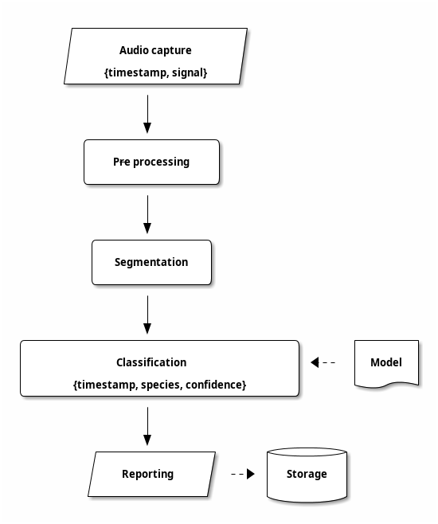

Architecture
============

Making observations from acoustic data can be divided into several
steps. Firstly the acoustic sample has to be **captured** in digital form,
and then possible be **pre-processed** to enhance or remove features
such as low-frequency rumbles or static noise. This digitised signal
is then **segmented** into smaller timesteps. The segments often
overlap so that an interesting sound that appears on a boundary isn't
accidentally missed. Sometimes the segmentation and pre-processing
steps are reversed.

The segments are then fed to a **classifier** that extracts
observations from the signal. Modern systems often use machine
learning **models** to classify signals, although there are other ways
too. The classifier essentially turns a signal into a **observation**
of a particular **class**, usually with some sort of **confidence**
value as to "how good" the observation is. The observation is then
**reported**, which may involve transmission over a network to a
remote server and/or **storage** in a database or other medium.

``chirpy`` implements this pipeline as a collection of shell scripts
that are composed using Linux pipes. (These scripts are simply
wrappers around the underlying Python code, which may be used directly
in other ways as needed.) The advantage of this structure is that it
splits-up the logical components of the pipeline into separate tools
that can then be replaced and recombined as needed.

Components
----------

``chirpy`` uses standard Linux audio interfaces to capture audio
samples. (It can also use pre-recorded samples from files.)
The classification step used the BirdNET model, which can identify the
calls of over 6,000 bird species worldwide and so is suitable for use
out-of-the-box. The model is represented as a standard Tensorflow
``.tflite`` file.

Reporting is done by default using the MQTT protocol over wifi (or
wired) internet. This can optionally be replaced with LoRa radios.
Storage uses an SQLite database that can then be queries using any
appropriate tools and SQL queries.

Differences from the conceptual architecture
--------------------------------------------

BirdNET performs pre-processing within the model, *after* the signal
has been segmented.

The reporting step is split into two tools that talk across a network
to allow remote storage.
